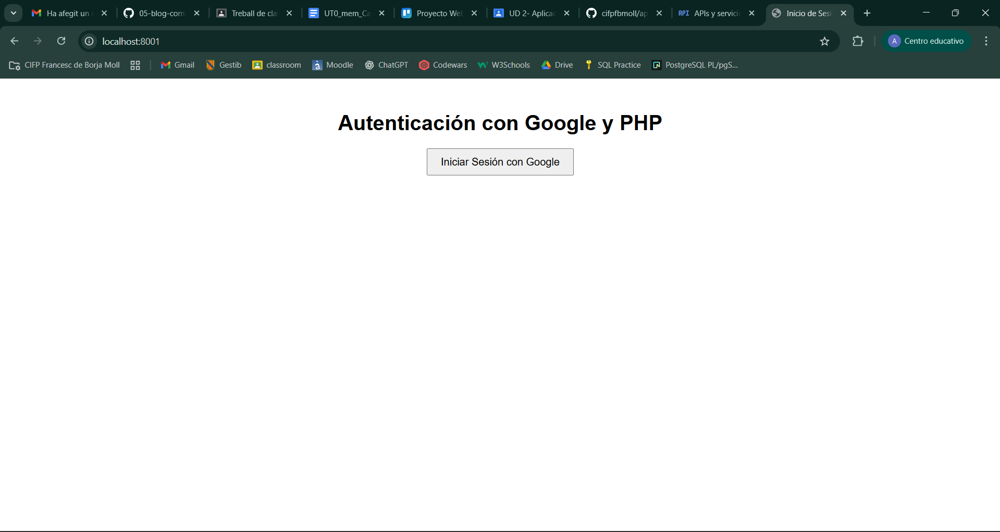
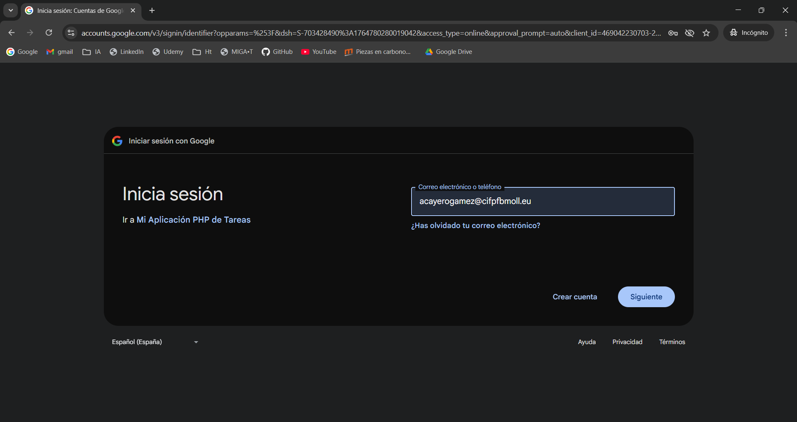
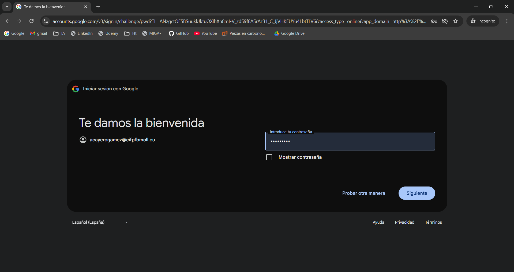
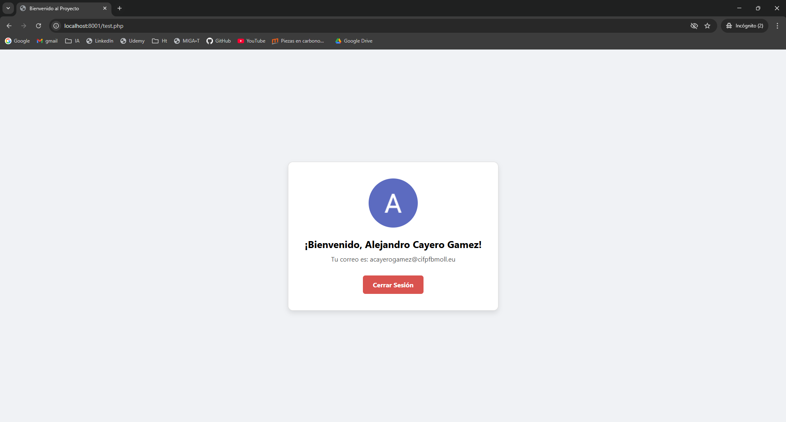

# Aplicación Web con PHP y Autenticación de Google

## 📖 Descripción del Proyecto

Este proyecto es una aplicación web sencilla, desarrollada en PHP "vanilla" (sin frameworks), que implementa un sistema de autenticación de usuarios utilizando el protocolo OAuth 2.0 de Google. Permite a los usuarios iniciar sesión de forma segura con su cuenta de Google y muestra sus datos básicos de perfil para confirmar que el proceso ha sido exitoso.

---

### ✨ Características Principales

*   **Autenticación segura con Google:** Implementación del flujo OAuth 2.0.
*   **Visualización de datos de perfil:** Muestra nombre, email y foto del usuario autenticado.
*   **Gestión de Sesión:** Funcionalidades completas para iniciar y cerrar la sesión.
*   **Código PHP Puro:** Desarrollado sin frameworks para enfocarse en los fundamentos.

---

### 🛠️ Tecnologías Utilizadas

*   **Backend:** PHP 8
*   **Autenticación:** Google API Client Library for PHP (OAuth 2.0)
*   **Gestión de Dependencias:** Composer
*   **Servidor de Desarrollo:** Servidor web integrado de PHP

---

### 📸 Flujo de la Aplicación (Capturas de Pantalla)

A continuación se muestra el flujo de autenticación de un usuario paso a paso.

**1. Acceso a la Página de Inicio**
El usuario accede a la aplicación y se le presenta la opción para iniciar sesión.

**2. Selección de Cuenta de Google**
Al hacer clic, Google solicita al usuario que elija la cuenta con la que desea continuar.

**3. Ingreso de Contraseña**
El usuario introduce su contraseña para verificar su identidad de forma segura en los servidores de Google.

**4. Usuario Verificado y Página de Bienvenida**
Una vez verificado, el usuario es redirigido a la aplicación, donde se le da la bienvenida y se muestran sus datos de perfil.

---

### 👥 Autor

*   **Alejandro Cayero Gámez** - [Acayerogamez](https://github.com/Acayerogamez)
